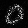
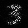

# mnist
Deep learning concepts tried out on mnist

# GAN
Simple GAN architecture in gan.py. Generator network has two layers with leaky Relu activation with hidden layer having 128 units. 
Optimizer used is Adam. Discriminator and generator trained alternatively for 0-8. '9' proves to be a harder one to learn so discriminator to generator training steps is 10:1.

## Results for gan - 

   
   

   
   

   
   

   
   

   
   

## What worked
Wasserstein loss works well without label flipping (D(x) = 1 if z is a real sample and D(x) = 0 if z is a fake sample).
Although the training could be unstable. Adding noise to generated sample before feeding to generated results in better convergence. Although with this architecture y = D(x), y is not bounded between 0 to 1 due to no sigmoid layer at the end. This leads to better convergence, but at loss of some interpretability.

## What doesn't work
Adaptive k (number of steps discriminator is trained before generator gets updated). Doesn't really solve the mode collapse problem if the architecture is bad.
